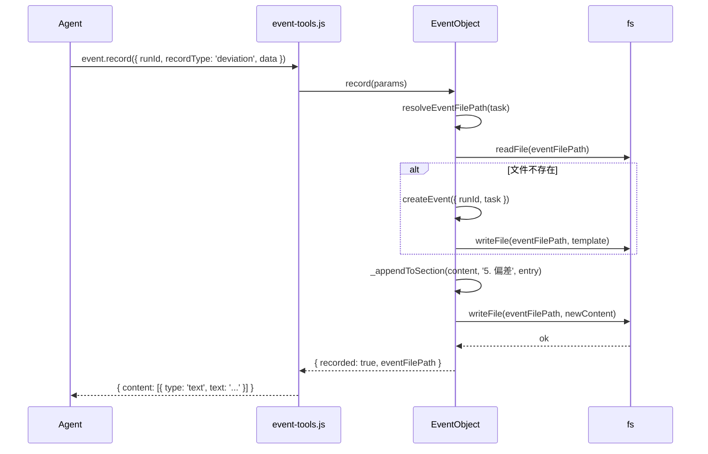
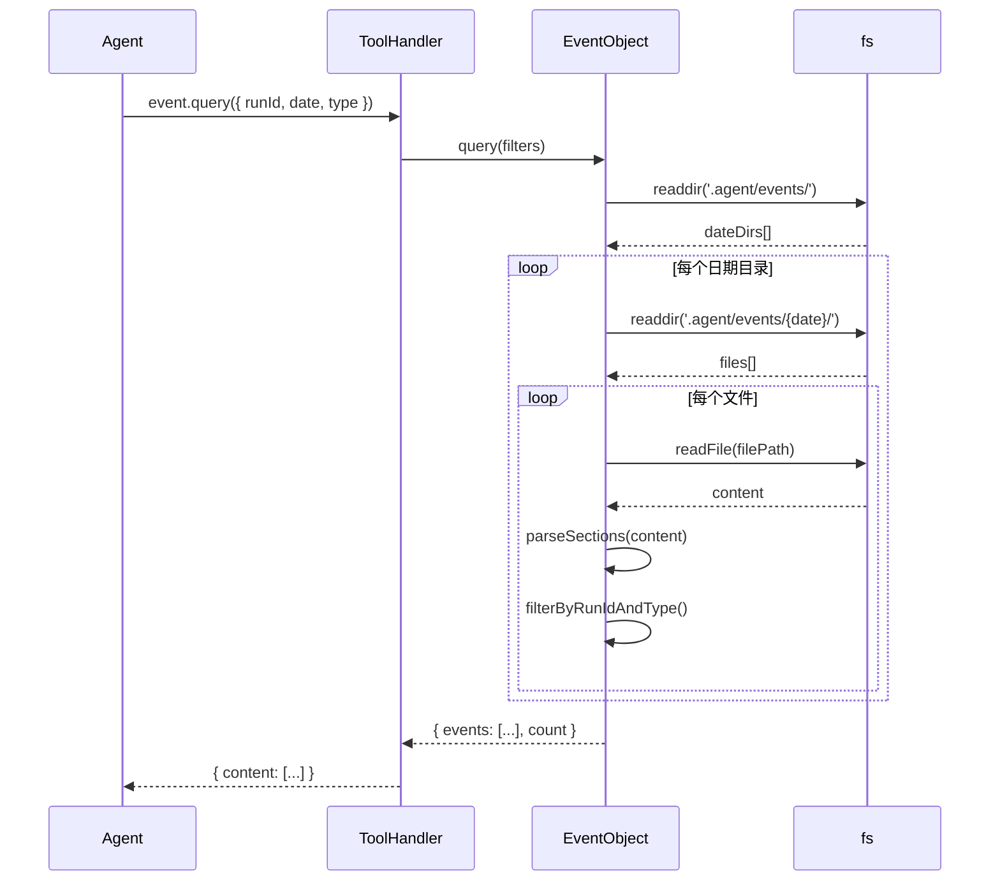

# EventObject 接口规范

> **版本**：v4.3.0  
> **范围**：`src/objects/event-object.js`  
> **状态**：⚠️ 待更新（Pending Update）  
> **作者**：Architect

> **⚠️ 注意**：本文档基于旧方案（`v4.3.0-design.md`，已废弃），部分接口与新方向不一致：
> - `createEvent()` + `record()` 增量追加 → **应改为 `generate(runId, task)` 一次性凝练**
> - EventObject 实时追加 → **改为 task 完成后延迟渲染**
> - 准确接口定义以 `docs/roadmap/v4.3.0.md` 和 `docs/architecture/adr-013.md` 为准

---

## 1. 概述

EventObject 是项目级 `event.md` 的**唯一写入者**，负责事件 Markdown 文件的创建、章节追加、查询和归档。

与系统级 `MemoryArchive`（原 Event 类）的职责边界：
- **EventObject** 管理 `.agent/events/*.md`（项目级文件）
- **MemoryArchive** 管理 `~/.agent/memory/{agentId}.sqlite`（系统级归档）

---

## 2. 类定义

```typescript
class EventObject {
  constructor(deps: EventObjectDeps);

  async createEvent(params: CreateEventParams): Promise<CreateEventResult>;
  async record(params: RecordParams): Promise<RecordResult>;
  async query(filters: QueryFilters): Promise<QueryResult>;
  async archive(runId: string): Promise<ArchiveResult>;
}
```

---

## 3. 依赖注入

```typescript
interface EventObjectDeps {
  logger?: Logger;
  eventTemplate: string;        // assets/event.md 加载后的模板字符串
  projectRoot?: string;          // 项目根目录，默认 process.cwd()
}
```

---

## 4. 方法契约

### 4.1 createEvent — 创建事件文件

```typescript
interface CreateEventParams {
  runId: string;
  task: Task;                    // 完整的 task 对象，用于渲染模板
  agentId?: string;              // 默认 'main'
}

interface CreateEventResult {
  eventFilePath: string;         // 相对路径，如 .agent/events/2026-05-19/01-31-00.md
}
```

**行为**：
1. 根据 `task.createdAt` 解析日期和时间，生成文件路径
2. 读取 `assets/event.md` 模板
3. 替换占位符：`{{runId}}`, `{{agentId}}`, `{{createdAt}}`, `{{planSummary}}` 等
4. 确保目录存在（`.agent/events/{YYYY-MM-DD}/`）
5. 写入 Markdown 文件

**模板占位符**：

| 占位符 | 来源 | 示例 |
|--------|------|------|
| `{{runId}}` | `task.runId` | `task-001` |
| `{{agentId}}` | `params.agentId` | `main` |
| `{{createdAt}}` | `new Date(task.createdAt).toISOString()` | `2026-05-19T01:31:00.000Z` |
| `{{planSummary}}` | `task.plan.prompt` + `task.plan.execution.phases` 摘要 | — |
| `{{executionSummary}}` | 当前执行状态摘要 | — |
| `{{changeLog}}` | 变更记录（首次为空） | — |
| `{{outcome}}` | 结果（首次为空） | — |

**错误**：
- `ValidationError`：`runId` 为空或 `task` 无效
- `WriteError`：文件系统写入失败

---

### 4.2 record — 记录偏差或归因

```typescript
interface RecordParams {
  runId: string;
  recordType: 'deviation' | 'attribution';
  data: DeviationData | AttributionData;
}

interface DeviationData {
  type: string;
  description: string;
  impact?: string;
}

interface AttributionData {
  rootCause: string;
  impact?: string;
  strategy: string;
}

interface RecordResult {
  recorded: boolean;
  eventFilePath?: string;
  error?: string;
}
```

**行为**：
1. 解析事件文件路径（根据 `task.createdAt`）
2. 若文件不存在，先调用 `createEvent()` 创建
3. 根据 `recordType` 选择追加章节：
   - `'deviation'` → 追加到 `## 5. 偏差` 章节
   - `'attribution'` → 追加到 `## 6. 归因` 章节
4. 使用「章节切片」追加策略（不重新渲染全文件）
5. 返回事件文件路径

**追加条目格式**：

**偏差条目**：
```markdown
- **{type}** ({timestamp}): {description}{impact ? ` — 影响: ${impact}` : ''}
```

**归因条目**：
```markdown
- **{id}** ({timestamp}): 根因: {rootCause} — 策略: {strategy}{impact ? ` — 影响: ${impact}` : ''}
```

**章节切片策略**：

```typescript
// 伪代码
function appendToSection(content: string, sectionTitle: string, entry: string): string {
  // 匹配 "## {sectionTitle}" 到下一个 "## " 或文件末尾之间的内容
  const regex = new RegExp(`(##\\s*${sectionTitle}[\\s\\S]*?)(?=##\\s*|$)`);
  const match = content.match(regex);
  if (!match) return null; // 章节不存在
  
  const insertPos = match.index + match[0].length;
  return content.slice(0, insertPos) + '\n' + entry + content.slice(insertPos);
}
```

**性能要求**：
- 单次追加操作 < 50ms（文件大小 < 1MB 时）
- 不重新渲染全文件，只读写章节边界附近内容

**错误**：
- `NotFoundError`：找不到对应 task（无法解析事件文件路径）
- `SectionNotFoundError`：事件文件中找不到目标章节
- `WriteError`：追加写入失败

---

### 4.3 query — 查询事件

```typescript
interface QueryFilters {
  runId?: string;          // 精确匹配任务 ID
  date?: string;           // YYYY-MM-DD，匹配日期目录
  type?: 'deviation' | 'attribution';  // 记录类型
}

interface EventRecord {
  runId: string;
  date: string;
  time: string;
  type: 'deviation' | 'attribution';
  data: {
    id: string;
    timestamp: number;
    [key: string]: any;
  };
  sourceFile: string;      // 相对路径
}

interface QueryResult {
  events: EventRecord[];
  count: number;
}
```

**行为**：
1. 扫描 `.agent/events/` 目录
2. 根据 `date` 过滤日期子目录
3. 读取每个 `.md` 文件，解析章节内容
4. 根据 `runId` 和 `type` 进一步过滤
5. 返回结构化 JSON（非原始 Markdown）

**解析策略**：
- 偏差章节：正则提取 `- **{type}** ({timestamp}): {description}` 模式
- 归因章节：正则提取 `- **{id}** ({timestamp}): 根因: {rootCause} — 策略: {strategy}` 模式

**性能说明**：
- 查询是「全量扫描 + 正则解析」，适合单次查询（非高频）
- 若未来事件文件数量 > 1000，需引入索引层（P2 优化项）

**错误**：
- `ReadError`：文件读取失败

---

### 4.4 archive — 归档事件

```typescript
interface ArchiveResult {
  archived: boolean;
  archivedPath?: string;
  error?: string;
}
```

**行为**：
1. 查找 `.agent/events/` 下与该 `runId` 关联的所有事件文件
2. 移动到 `.agent/events/archive/`（或根据项目约定）
3. 返回归档路径

**当前版本说明**：
- v4.3.0 中事件归档为「轻量级」操作（移动文件）
- 系统级 EventLog 归档由 `MemoryArchive` 负责（原 Event 类）

---

## 5. 事件文件结构契约

### 5.1 七章节模板（assets/event.md）

事件 Markdown 文件必须包含以下七个章节，顺序固定：

```markdown
# Event: {runId}

## 1. 元信息
- runId: {runId}
- agentId: {agentId}
- createdAt: {createdAt}

## 2. 计划
{planSummary}

## 3. 执行
{executionSummary}

## 4. 变更记录
{changeLog}

## 5. 偏差
<!-- deviations appended here -->

## 6. 归因
<!-- attributions appended here -->

## 7. 结果
{outcome}
```

### 5.2 章节锚点

EventObject 使用章节标题作为追加锚点：
- `## 5. 偏差` 或 `## 5\. 偏差`（正则兼容空格和标点）
- `## 6. 归因` 或 `## 6\. 归因`

**章节边界判定**：从章节标题开始，到下一个 `## ` 开头或文件末尾。

---

## 6. 错误类型

| 错误类 | 触发条件 | 返回示例 |
|--------|----------|----------|
| `ValidationError` | 参数校验失败 | `{ error: 'runId 不能为空' }` |
| `NotFoundError` | 找不到 task 或事件文件 | `{ error: '事件文件不存在: ...' }` |
| `SectionNotFoundError` | 找不到目标章节 | `{ error: '找不到「偏差」章节' }` |
| `WriteError` | 文件写入失败 | `{ error: '写入失败: EACCES' }` |
| `ReadError` | 文件读取失败 | `{ error: '读取失败: ENOENT' }` |

---

## 7. 序列图

### 7.1 记录偏差



### 7.2 查询事件



---

## 8. 与 TaskObject 的协作

EventObject 不直接操作 `task.json`，但需要读取 task 信息来解析事件文件路径和渲染模板。

**协作边界**：
- EventObject 接收 `task` 对象作为参数（由 Tool Handler 从 TaskObject 获取后传入）
- EventObject 不调用 `TaskObject.get()`，避免循环依赖
- 事件文件路径解析使用 `project-context.js` 的 `resolveEventFilePath(task)`

---

*文档版本：v1.0.0*  
*维护者：Architect*  
*最后更新：2026-05-19*  
*[ARCH_READY]*
