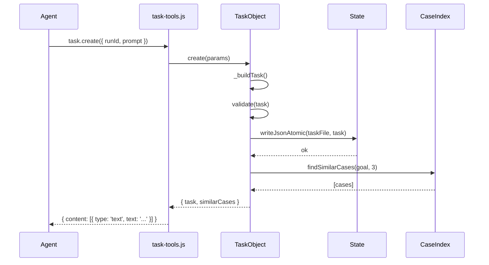
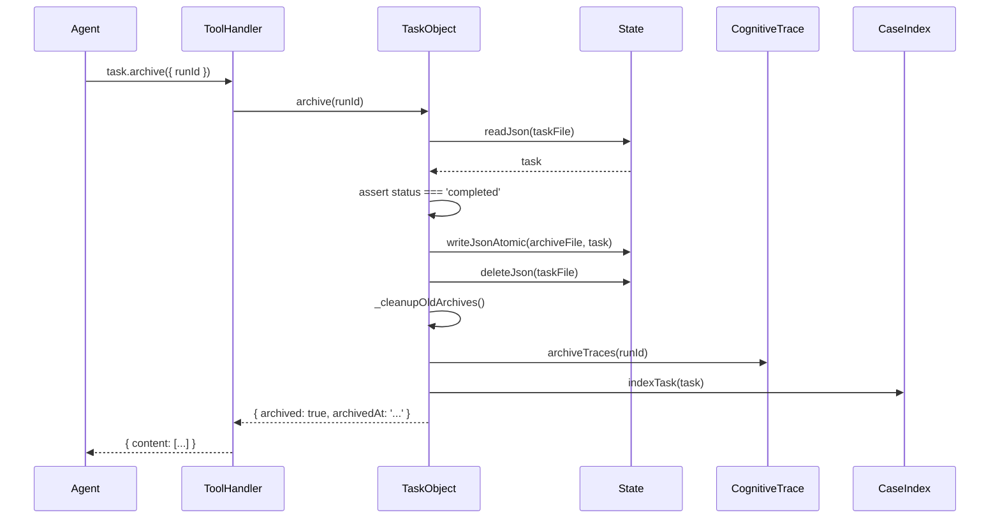

# TaskObject 接口规范

> **版本**：v4.3.0  
> **范围**：`src/objects/task-object.js`  
> **状态**：⚠️ 待更新（Pending Update）  
> **作者**：Architect

> **⚠️ 注意**：本文档基于旧方案（`v4.3.0-design.md`，已废弃），部分接口与新方向不一致：
> - 缺少 `recordDeviation()` / `recordAttribution()` / `setOutcome()` / `linkEventFile()` 方法定义
> - `diagnose()` / `getFiles()` 方法在新方向中可能移除或简化
> - `deps.state` 应改为 `deps.projectRoot`（项目级路径，非系统级 adapter）
> - 准确接口定义以 `docs/roadmap/v4.3.0.md` 和 `docs/architecture/adr-010.md` 为准

---

## 1. 概述

TaskObject 是 `task.json` 的**唯一写入者**，负责任务全生命周期的业务规则、数据校验和状态机管理。

---

## 2. 类定义

```typescript
class TaskObject {
  constructor(deps: TaskObjectDeps);
  
  async create(params: CreateParams): Promise<CreateResult>;
  async get(runId: string): Promise<GetResult>;
  async getFiles(runId: string): Promise<GetFilesResult>;
  async update(params: UpdateParams): Promise<UpdateResult>;
  async advance(params: AdvanceParams): Promise<AdvanceResult>;
  async archive(runId: string): Promise<ArchiveResult>;
  async diagnose(runId?: string): Promise<DiagnoseResult>;
  validate(task: Task): ValidationResult;
}
```

---

## 3. 依赖注入

```typescript
interface TaskObjectDeps {
  state: State;                    // 纯 IO adapter（降级后的 State）
  logger?: Logger;                 // 可选日志
  log?: Log;                       // 可选结构化日志
  caseIndex?: CaseIndex;           // 可选案例索引
  taskSchema: object;              // assets/task.json 加载后的 schema 对象
  maxArchivedTasks?: number;        // 归档清理阈值，默认 50
}
```

---

## 4. 方法契约

### 4.1 create — 创建任务

```typescript
interface CreateParams {
  runId: string;                          // 任务 ID，必填
  prompt: string;                         // 用户原始输入，必填
  taskType?: 'coding' | 'research' | 'documentation';  // 任务类型，可选
  planInput?: {
    goal?: string;
    constraints?: string[];
    successCriteria?: string[];
    phases?: {
      id?: string;
      name?: string;
      goal?: string;
      outputs?: string[];
      status?: 'pending' | 'in_progress' | 'completed';
    }[];
  };
}

interface CreateResult {
  task: Task;                             // 创建后的完整 task 对象
  similarCases?: Array<{
    runId: string;
    goal: string;
    similarity: number;
  }>;  // 相似案例（若 caseIndex 不可用则无）
}
```

**前置条件**：
- `runId` 非空，匹配 `[a-zA-Z0-9_-]+`
- 同 `runId` 的任务不存在（通过 `state.exists()` 检查）

**后置条件**：
- 系统级 `tasks/{runId}.json` 已创建
- `task.status === 'draft'`
- `task.createdAt === task.updatedAt === Date.now()`
- `task.deviations === []`, `task.attributions === []`

**错误**：
- `ValidationError`：参数校验失败（返回 `{ valid: false, errors: string[] }`）
- `DuplicateError`：`runId` 已存在

---

### 4.2 get — 查询任务

```typescript
interface GetResult {
  task: Task | null;
}
```

**行为**：
- 读取系统级 `tasks/{runId}.json`
- 若文件不存在，返回 `{ task: null }`

---

### 4.3 getFiles — 查询任务关联文件

```typescript
interface FileRef {
  path: string;
  type: string;
  description?: string;
}

interface GetFilesResult {
  files: FileRef[];
  count: number;
  note?: string;     // 例如："无项目级文件索引"
}
```

**行为**：
- 读取项目级 `.agent/tasks/{runId}.json`
- 若文件不存在或 `files` 字段缺失，返回 `{ files: [], count: 0, note: '无项目级文件索引' }`

---

### 4.4 update — 更新任务状态

```typescript
interface UpdateParams {
  runId: string;
  status: 'draft' | 'pending_approval' | 'active' | 'revising' | 'completed';
  reason?: string;
}

interface UpdateResult {
  task: Task;
  previousStatus: string;
}
```

**前置条件**：
- `runId` 存在
- `status` 为有效枚举值

**后置条件**：
- `task.status === params.status`
- `task.updatedAt` 更新为当前时间戳
- 若 `reason` 存在，`task.revisionReason = reason`

**状态机校验**：

| 当前状态 | 允许的新状态 | 说明 |
|----------|-------------|------|
| `draft` | `pending_approval`, `completed` | — |
| `pending_approval` | `active`, `revising`, `completed` | — |
| `active` | `revising`, `completed` | — |
| `revising` | `draft` | 修订后回到 draft |
| `completed` | *(无)* | 已完成不可直接变更，需先 archive |

**错误**：
- `NotFoundError`：task 不存在
- `InvalidStatusError`：status 枚举值无效
- `StateTransitionError`：状态转换不符合状态机规则

---

### 4.5 advance — 推进阶段

```typescript
interface AdvanceParams {
  runId: string;
  phaseId?: string;    // 可选，指定阶段 ID；未指定则推进到下一阶段
}

interface AdvanceResult {
  task: Task;
  previousPhase: number;
  nextPhase: number;
  isComplete: boolean;
}
```

**前置条件**：
- `runId` 存在
- `task.plan.execution.phases.length > 0`

**行为**：
- 若指定 `phaseId`，找到对应索引，标记该阶段为 `completed`，设置 `currentPhase` 为该索引
- 若未指定 `phaseId`，标记当前阶段为 `completed`，`currentPhase++`
- 若 `nextPhase >= phases.length`，`isComplete = true`，同时 `task.status = 'completed'`

**后置条件**：
- 被推进的阶段 `status === 'completed'`
- `task.updatedAt` 更新
- `task.plan.execution.currentPhase === nextPhase`

---

### 4.6 archive — 归档任务

```typescript
interface ArchiveResult {
  archived: boolean;
  archivedAt?: string;
  error?: string;
}
```

**前置条件**：
- `runId` 存在
- `task.status === 'completed'`

**行为**：
1. 读取 task
2. 校验 `status === 'completed'`
3. 从 `tasks/` 移至 `archive/`
4. 追加 `archivedAt` 字段
5. 清理旧归档（保留最近 `maxArchivedTasks` 个）
6. 归档认知轨迹（调用 `archiveTraces(runId)`）
7. 写入案例索引（若 `caseIndex` 可用）
8. 触发系统级归档（若 `events` 实例可用）

**后置条件**：
- 系统级 `tasks/{runId}.json` 已删除
- 系统级 `archive/{runId}.json` 已创建

**错误**：
- `NotFoundError`：task 不存在
- `NotCompletedError`：task 状态不是 completed

---

### 4.7 diagnose — 诊断任务

```typescript
interface DiagnoseResult {
  diagnosis: Diagnosis;
}

interface Diagnosis {
  plugin: string;
  version: string;
  timestamp: string;
  mode?: 'task' | 'global';
  taskStatus?: string;
  phase?: number;
  totalPhases?: number;
  deviations?: number;
  attributions?: number;
  activeTasks?: number;
  completedTasks?: number;
  cognitiveTraceSummary?: {
    toolCallCount: number;
    lastToolCall?: string;
    elapsedSinceLastCall?: string;
    recentCalls: Array<{ tool: string; t: number }>;
  };
  trendAnalysis?: {
    phaseElapsedTime: string;
    avgPhaseTime: string | null;
    deviationRate: string;
    riskFlags: string[];
  };
  toolsAvailable?: string[];
}
```

**行为**：
- 若提供 `runId`，返回该任务的诊断信息
- 若未提供 `runId`，返回全局诊断信息

---

### 4.8 validate — 校验任务结构

```typescript
interface ValidationResult {
  valid: boolean;
  errors?: string[];
}
```

**校验规则**：

| 字段 | 类型 | 必填 | 规则 |
|------|------|------|------|
| `runId` | string | ✅ | 非空，匹配 `[a-zA-Z0-9_-]+` |
| `status` | string | ✅ | 枚举：`draft`, `pending_approval`, `active`, `revising`, `completed` |
| `createdAt` | number | ✅ | 正整数时间戳 |
| `updatedAt` | number | ✅ | ≥ `createdAt` |
| `plan` | object | ✅ | 必须包含 `prompt`, `context`, `workspace`, `execution` |
| `plan.execution.phases` | array | ✅ | 长度 ≥ 1，每个元素有 `id`, `name`, `status` |
| `deviations` | array | — | 若存在，元素必须有 `id`, `type`, `description`, `timestamp` |
| `attributions` | array | — | 若存在，元素必须有 `id`, `rootCause`, `strategy`, `timestamp` |

---

## 5. 数据结构

### 5.1 Task 对象（系统级）

```typescript
interface Task {
  runId: string;
  status: 'draft' | 'pending_approval' | 'active' | 'revising' | 'completed';
  taskType?: 'coding' | 'research' | 'documentation';
  createdAt: number;
  updatedAt: number;
  plan: {
    prompt: string;
    createdAt: number;
    context: {
      goal: string;
      constraints: string[];
      successCriteria: string[];
    };
    workspace: {
      artifacts: string[];
      tools: string[];
      skills: string[];
    };
    execution: {
      phases: Phase[];
      currentPhase: number;
    };
  };
  deviations: Deviation[];
  attributions: Attribution[];
  outcome?: object;
  sessionIds: string[];
  tools: string[];
  revisionReason?: string;
  eventFilePath?: string;
}

interface Phase {
  id: string;
  name: string;
  goal: string;
  outputs: string[];
  status: 'pending' | 'in_progress' | 'completed';
  tools?: string[];
  skills?: string[];
}

interface Deviation {
  id: string;
  type: string;
  description: string;
  impact?: string;
  timestamp: number;
  attributed: boolean;
  attributionId?: string;
}

interface Attribution {
  id: string;
  rootCause: string;
  impact?: string;
  strategy: string;
  timestamp: number;
}
```

---

## 6. 错误类型

| 错误类 | 触发条件 | 返回示例 |
|--------|----------|----------|
| `ValidationError` | `validate()` 失败 | `{ valid: false, errors: ['runId 不能为空'] }` |
| `DuplicateError` | `create()` 时 runId 已存在 | `{ error: 'task 已存在: task-001' }` |
| `NotFoundError` | `get()` / `update()` / `advance()` / `archive()` 时 task 不存在 | `{ error: 'task 不存在: task-001' }` |
| `InvalidStatusError` | `status` 不是有效枚举值 | `{ error: '无效状态: xxx，有效值: ...' }` |
| `StateTransitionError` | 状态转换不符合状态机 | `{ error: '不允许从 completed 转换到 active' }` |
| `NotCompletedError` | `archive()` 时 status ≠ completed | `{ error: 'task 状态不是 completed（当前: draft），无法归档' }` |

---

## 7. 序列图

### 7.1 任务创建



### 7.2 任务归档



---

*文档版本：v1.0.0*  
*维护者：Architect*  
*最后更新：2026-05-19*  
*[ARCH_READY]*
